# Code CIN - 高级语言与运行时

---

**Code CIN - ByUsi Studio**

**开发者: 北啊呢**

---

## 项目简介

Code CIN 是一门简洁的类 C 高级语言及其跨平台运行时（VM）。它从 CIN 源码出发，编译为 UCPU 字节码后由 **Go 原生 VM**（默认）/ JIT / Python 解释器三路径执行，行为一致。除完整语言工具链外，还内置 **2D 绘图画布（导出 PNG）** 与 **联网音频播放** 等宿主能力。

正在从 Python 优先**逐步切换为 Go 优先**：Go 是语言实现的核心（`codecin/native/` 下的 CIN 编译器、字节码 VM、CROM），**Go 侧不提供任何 CLI 入口**；Python 只作为唯一 CLI 外壳与回退路径。支持 CIN/PL/ASM 三语言、ARM64 与 RISC-V 指令集扩展、JIT 编译、缓存系统、性能分析与调试。

模块化包结构（`codecin/`，Go 侧 `codecin/native/`），全线日志与错误输出基于 **rich**（彩色表格、面板、traceback），`--debug` 模式提供逐指令/寄存器/内存/栈/缓存的超详细追踪。

## 文档

**官方文档站**位于独立仓库
[Code-CIN-Docs](https://github.com/ByUsiStudio/Code-CIN-Docs) (VitePress +
vitepress-plugin-tabs); 线上站点即由该仓库构建。本仓库不再内嵌 `docs/`
(子模块已移除), 需要本地预览时请**单独克隆该仓库**:

```bash
git clone https://github.com/ByUsiStudio/Code-CIN-Docs.git
cd Code-CIN-Docs
npm install
npm run docs:dev                           # 本地预览 (http://localhost:5173)
npm run docs:build                         # 构建静态站点到 .vitepress/dist
```

站点内容划分: `guide/` (安装/快速开始/命令行/执行路径/架构/示例/FAQ)、`language/` (CIN 语言)、
`asm/` (汇编与 ISA)、`stdlib/` (内置标准库参考)、`runtime/` (原生/JIT/格式/AOT)、
`tools/` (调试器/远程调试/日志/性能/内存缓存)、`reference/` (ISA 编码表/寄存器与内存/Python API/更新日志)、
`dev/` (项目结构/构建/测试/打包/扩展/贡献)。

仓库的开发用文档**全部在独立仓库** [Code-CIN-Docs](https://github.com/ByUsiStudio/Code-CIN-Docs)
(不进站点, 供源码树内直接查阅):

| 文档 | 说明 |
|------|------|
| [指令集参考 (ISA)](https://github.com/ByUsiStudio/Code-CIN-Docs/blob/main/ISA.md) | 由 `codecin/isa.py` 自动生成的逐条指令表 (唯一真源; 站点版为 `reference/isa.md`) |
| [开发者编译文档 (BUILDING)](https://github.com/ByUsiStudio/Code-CIN-Docs/blob/main/BUILDING.md) | 环境搭建、Go 原生库编译、构建产物、打包、日志系统、扩展指南 |
| [CIN 编程指南 (CIN_GUIDE)](https://github.com/ByUsiStudio/Code-CIN-Docs/blob/main/CIN_GUIDE.md) | CIN 高级语言完整语法：类型/函数/struct/数组/字符串/内建函数 |
| [远程调试协议 (REMOTE_DEBUG)](https://github.com/ByUsiStudio/Code-CIN-Docs/blob/main/REMOTE_DEBUG.md) | `--debug-server` 换行文本协议：命令/响应/状态机/示例会话 |

> 这些文件不在本仓库内: 需要时单独 `git clone` 上述文档仓库即可。

---

## 设计理念

Code CIN的设计围绕五个核心原则展开：

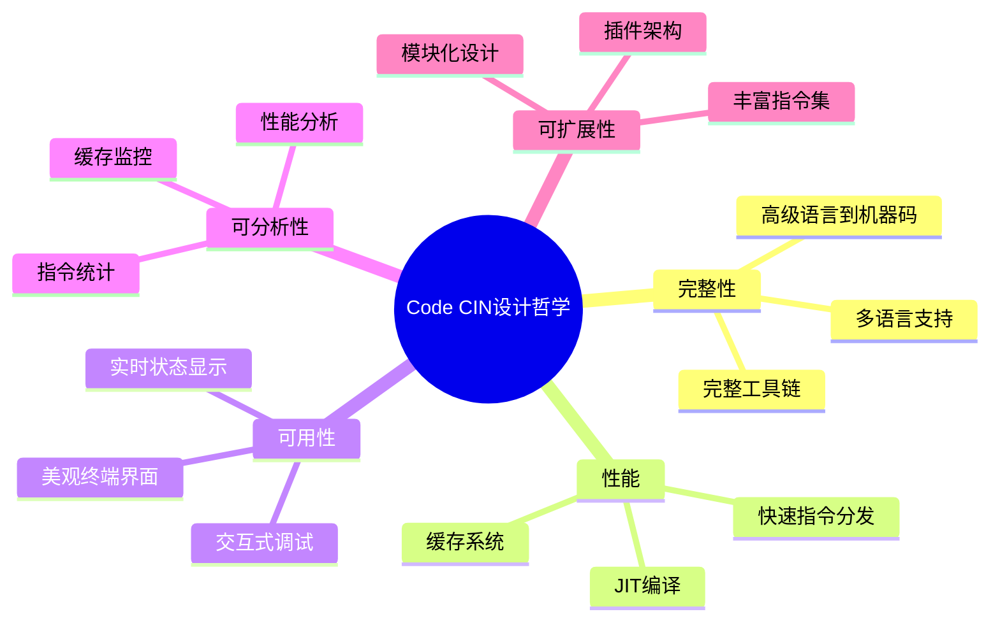

---

## 核心特性

### 多语言支持

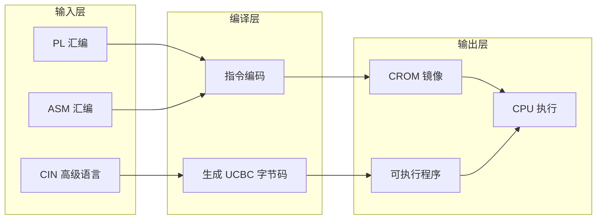

### 功能矩阵

| 功能模块 | 状态 | 说明 |
|----------|------|------|
| 指令集 | 112条 | Base + ARM64 + RISC-V + FP + Vector + SYS |
| 寄存器 | 32+32 | 通用寄存器 + 向量寄存器 |
| 内存系统 | 可配置 | 保护机制 + 分页支持 |
| 缓存系统 | LRU | 可配置大小/关联度 |
| JIT编译 | 动态 | 热点基本块编译优化 (与debug互斥) |
| Go原生库 | c-shared | 整程序VM加速, 缺失时自动回退纯Python |
| 日志系统 | rich | 彩色日志/表格/面板/traceback, --debug超详细追踪 |
| 调试器 | 交互式 | 断点 + 单步 + 状态查看 |
| 性能分析 | 指令级 | CPI + 缓存统计 + 热指令 |
| CROM压缩 | zlib | 节省存储空间 (Go/Python双实现) |
| AOT 静态编译 | 独立可执行 | 编译为 Windows/Linux/macOS 静态可执行文件, 不需 Python/Go/动态库 |

---

## 系统架构

### 分层架构

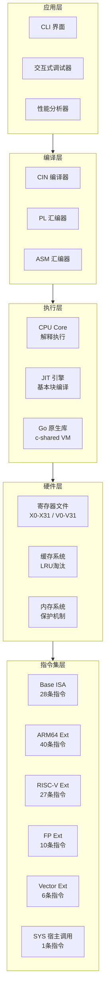

### 数据流


### 执行时序

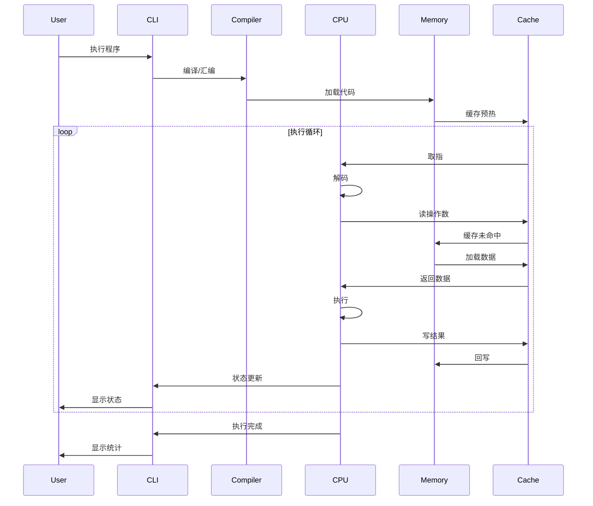

---

## 指令集架构

### 指令集总览

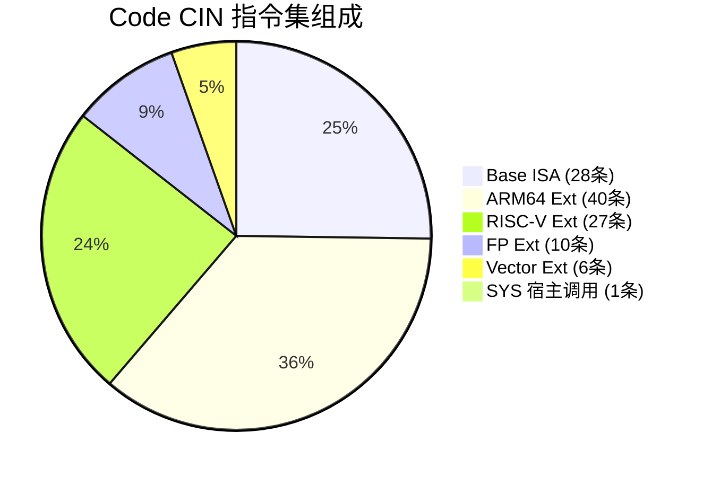

> 指令总数与分组由 `python script/gen_isa_docs.py` 依据 `codecin/isa.py` 自动生成/校验;
> 完整的逐条指令表见 [ISA.md](https://github.com/ByUsiStudio/Code-CIN-Docs/blob/main/ISA.md)
> (文档站已在独立仓库)。ARM64 的 WFE/WFI/SEV 无事件模型, 语义等同 NOP。

### 指令分类

```mermaid
graph TD
    ISA[Code CIN ISA<br/>112条指令]
    
    ISA --> BASE[Base ISA<br/>28条指令]
    ISA --> ARM[ARM64 Ext<br/>40条指令]
    ISA --> RISCV[RISC-V Ext<br/>27条指令]
    ISA --> FP[FP Ext<br/>10条指令]
    ISA --> VEC[Vector Ext<br/>6条指令]
    ISA --> SYS[SYS 宿主调用<br/>1条指令]
    
    BASE --> B1[数据传输: MOV, LOAD, STORE]
    BASE --> B2[算术: ADD, SUB, MUL, DIV]
    BASE --> B3[逻辑: AND, OR, XOR, SHL, SHR]
    BASE --> B4[控制: JMP, JZ, CALL, RET]
    
    ARM --> A1[条件: ADDS, SUBS]
    ARM --> A2[移位: LSL, LSR, ASR, ROR]
    ARM --> A3[加载存储: LDR, STR, LDP, STP]
    ARM --> A4[分支: CBZ, CBNZ, B, BL]
    
    RISCV --> R1[加载: LB, LH, LW, LD]
    RISCV --> R2[存储: SB, SH, SW, SD]
    RISCV --> R3[立即数: ADDI, XORI, ORI, ANDI]
    RISCV --> R4[分支: BEQ, BNE, BLT, BGE]
    
    FP --> F1[运算: FADD, FSUB, FMUL, FDIV]
    FP --> F2[比较: FCMP]
    FP --> F3[转换: FCVT]
    
    VEC --> V1[向量运算: VADD, VSUB, VMUL, VDIV]
    VEC --> V2[向量加载存储: VLD1, VST1]
```

### Base指令集 (28条)

| 分类 | 指令 | 说明 |
|------|------|------|
| 数据传输 | MOV, LOAD, STORE | 数据移动和内存访问 |
| 算术 | ADD, SUB, MUL, DIV | 基本算术运算 |
| 逻辑 | AND, OR, XOR, SHL, SHR | 位运算和移位 |
| 控制 | JMP, JZ, JNZ, JE, JL, JG, CALL, RET | 程序流程控制 |
| 堆栈 | PUSH, POP | 栈操作 |
| I/O | IN, OUT | 输入输出 |
| 其他 | CMP, INC, DEC, HALT | 比较、自增、自减、停机 |

### ARM64扩展 (40条)

ADDS, SUBS, ADDC, SUBC, LSL, LSR, ASR, ROR, MVN, EOR, BIC, ORN, LDR, STR, LDP, STP, CBZ, CBNZ, TBZ, TBNZ, B, BL, BR, NOP, WFE, WFI, SEV, CSEL, CSINC, CSINV, CSNEG, SXTB, SXTH, SXTW, UXTB, UXTH, CLZ, CLS, RBIT, REV

> WFE/WFI/SEV: 模拟器无中断/多核事件模型, 语义等同 NOP (见 `codecin/cpu.py` `_OP_ALIASES`)。

### RISC-V扩展 (27条)

LB, LH, LW, LD, SB, SH, SW, SD, ADDI, SLTI, SLTIU, XORI, ORI, ANDI, SLLI, SRLI, SRAI, BEQ, BNE, BLT, BGE, BLTU, BGEU, JALR, JAL, LUI, AUIPC

### 浮点和向量指令

FADD, FSUB, FMUL, FDIV, FCMP, FCVT, FABS, FNEG, LDRS, STRS, VADD, VSUB, VMUL, VDIV, VLD1, VST1

---

## CROM文件格式

### v3格式结构

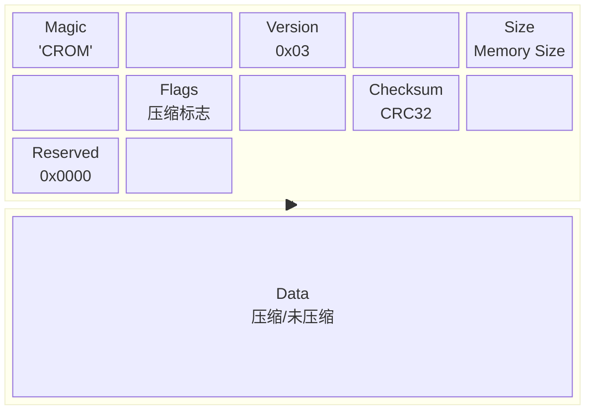

| 偏移 | 大小 | 字段 | 说明 |
|------|------|------|------|
| 0x00 | 4 | Magic | 'CROM' 魔数 |
| 0x04 | 1 | Version | 0x03 版本号 |
| 0x05 | 4 | Memory Size | 内存大小 |
| 0x09 | 1 | Flags | bit0: 压缩标志 |
| 0x0A | 4 | Checksum | CRC32校验和 |
| 0x0E | 2 | Reserved | 保留字段 |
| 0x10 | N | Data | 压缩/未压缩数据 |

### 版本对比

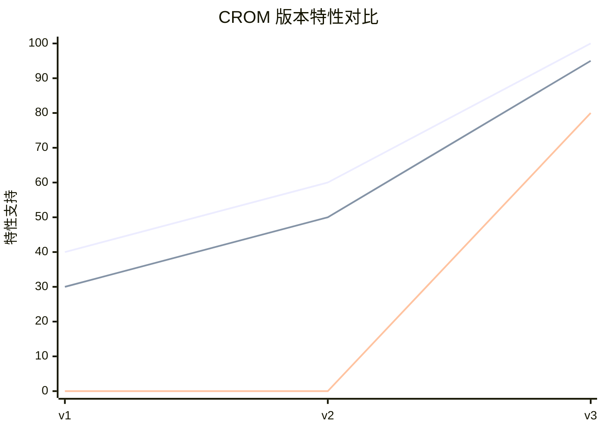

| 特性 | v1 | v2 | v3 |
|------|----|----|-----|
| 压缩支持 | 否 | 否 | 是 |
| 校验和 | 否 | 否 | 是 |
| 元数据 | 否 | 是 | 是 |
| 兼容性 | - | 是 | 是 |

---

## 使用指南

### 执行流程

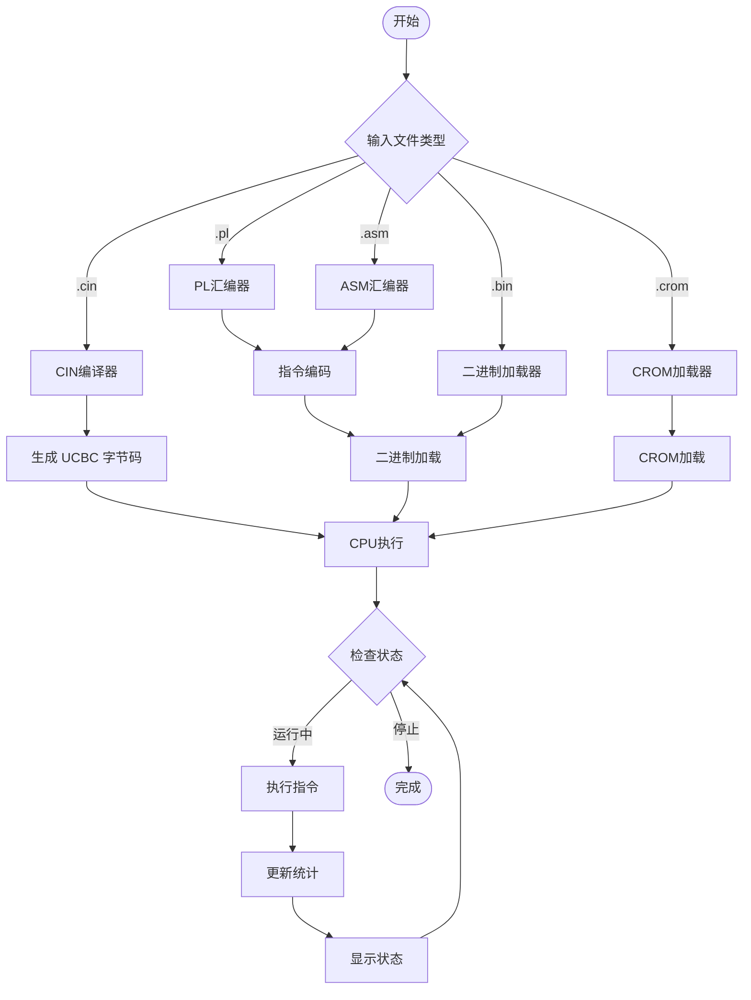

### 快速开始

**安装（pip）**

```bash
pip install codecin          # 内置标准库 (codecin/lib/*.cin) 随包分发
codecin --version
```

> 安装时会用**本机的 Go 工具链现场编译原生加速库** (没有 Go 也能装, 只是回退
> 纯 Python 解释执行; 用 `CODECIN_SKIP_NATIVE=1 pip install codecin` 可显式跳过)。
> 不想本地编译的话, 也可以直接从
> [Release](https://github.com/ByUsiStudio/Code-CIN/releases) 下载对应平台/架构的
> 预编译原生库放进包目录, 详见 [构建文档 · 6.3](docs/BUILDING.md#63-预编译原生库资产-x64-与-arm64)。

**手动（源码树）**

1. 克隆项目:
   ```
   git clone https://github.com/ByUsiStudio/code-cin.git
   cd code-cin
   ```

2. 编译 Go 原生库 (可选, 缺省时自动回退纯 Python 解释执行):
   ```
   cd codecin/native && ./build.sh        # Windows: .\build.ps1
   ```

3. 运行:
   ```
   python cpu.py basic.cin                          # 唯一 CLI 入口 (自动用 Go 原生库)
   codecin basic.cin                                # 安装后等价的 console script
   python cpu.py --help
   ```

> **Python 只是 CLI 外壳**: 语言实现 (`codecin/native/` 下的 Go 编译器与字节码 VM) 全部在 Go 侧,
> **Go 侧不提供任何 CLI 入口** (`package main`)。

### 开发与测试

```bash
python -m pytest                            # 指令黄金 / 三路径一致性 / 断点回归 / 内存保护 / CLI
python script/gen_native_isa.py --check     # Go 原生常量与指令集同步
ruff check codecin cpu.py script tests
```

仓库内置 GitHub Actions CI (`.github/workflows/ci.yml`): 多 Python 版本测试、ruff、Go 构建校验,
一个 `integration` 作业会**真实编译原生库**后跑全量测试 (带覆盖率门槛),
以及一个 `dist` 作业断言 wheel/sdist 里确实带有内置标准库。
完整逐条指令表由 `script/gen_isa_docs.py` 从 `codecin/isa.py` 生成到文档仓库
([ISA.md](https://github.com/ByUsiStudio/Code-CIN-Docs/blob/main/ISA.md))。

### 执行路径

| 路径 | 启用方式 | 特点 |
|------|----------|------|
| Go 原生 | 默认优先 (需编译库) | Python 编译 + Go VM 整程序一次执行, 速度最快 |
| JIT | `--jit` | 基本块动态编译, 与 `--debug` 互斥 |
| 解释执行 | `--no-native` 或回退 | 支持全部 debug/step 功能 |

> 三条路径对同一程序必须给出相同结果, 由 `script/check_paths.py` 与
> `tests/test_three_paths.py` 覆盖。

### 编译成独立可执行文件 (AOT)

把 CIN 程序编译成**静态链接的独立可执行文件** —— 产物内嵌字节码与初始内存镜像,
由内置 Go VM 执行, 运行时**不需要 Python、Go 工具链、libc 或任何动态库**。
构建时会解析 `import` 闭包做依赖完整性检查, 并把**全部依赖库在编译期展开嵌入产物**
(产物不读取任何 `.cin` 文件):

```bash
# 本机平台
python cpu.py program.cin --build-exe program          # Windows 自动补 .exe

# 交叉编译 (只需要安装 Go 工具链)
python cpu.py program.cin --build-exe app-linux --build-target linux/amd64
python cpu.py program.cin --build-exe app-mac   --build-target darwin/arm64
```

| 目标 | 说明 |
|------|------|
| `windows/amd64` `windows/arm64` | PE, 静态 (CGO_ENABLED=0) |
| `linux/amd64` `linux/arm64` | ELF, **无 PT_INTERP**, 不依赖 glibc |
| `darwin/amd64` `darwin/arm64` | Mach-O, 静态 |

常见选项: `--build-target OS/ARCH`、`--build-keep-temp` (保留 `go build` 临时目录排错)。
`import "math.cin"`（裸名字 = codecin 内置标准库 `codecin/lib/`）在**编译期**展开, 因此产物自带用到的标准库, 运行时不需要任何 `.cin` 文件。
正常结束退出码 0, 运行期错误打印 stderr 并以 1 退出。
详见 [开发者编译文档 · AOT](docs/BUILDING.md#aot-编译独立可执行文件)。

### 命令行选项

**基础执行**
- `python cpu.py program.cin` - 运行CIN程序
- `python cpu.py program.pl` - 运行PL程序
- `python cpu.py program.asm` - 运行ASM程序
- `python cpu.py program.bin` - 运行字节码

**执行路径**
- `--no-native` - 禁用 Go 原生库, 强制纯 Python
- `--jit` - 启用 Python JIT (基本块动态编译)

**日志与调试**
- `--debug` - 超详细 rich 调试 (逐指令/寄存器/内存/栈/缓存)
- `--step` - 交互式单步调试
- `--debug-server <port>` - 启动 TCP 远程调试服务 (驱动式: step/continue/break/regs/mem/history)
- `--log-level DEBUG|INFO|WARNING|ERROR` - 日志级别
- `--log-file <file>` - 日志输出到文件

**性能与行为**
- `--profile` - 性能统计
- `--cache-size 128` - 配置缓存大小
- `--mem-size <bytes>` - 内存大小
- `--max-instructions <n>` - 指令数上限
- `--seed <n>` - 随机种子 (确定性执行)
- `--bounds-check` - CIN 数组越界运行时检查
- `--mmu` - 启用 MMU 分页 (identity 页表, 未映射页缺页错误)

**编译选项**
- `--compile` / `--compile-only` - 编译为 .bin 字节码
- `--disasm` - 反汇编 .bin/UCBC 为文本清单后退出
- `-o, --output <file>` - 输出文件名
- `--no-io` - 禁止宿主 I/O
- `--strict` - 严格汇编模式

**CROM选项**
- `--save` - 保存CROM
- `--no-compress` - 禁用压缩
- `--crom <file>` - 加载指定 CROM 镜像

---

## 调试器

### 调试会话流程

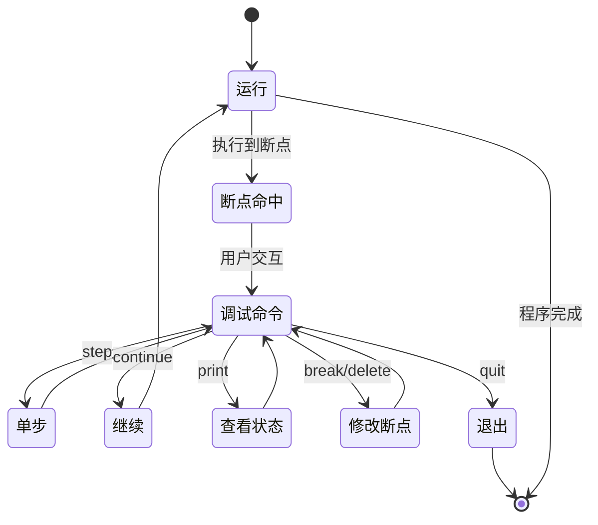

### 调试命令树

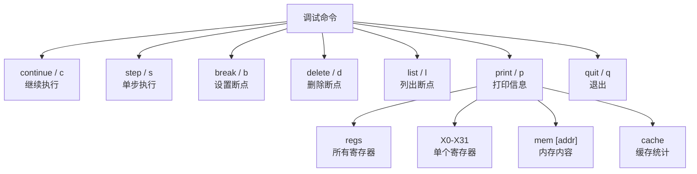

### 交互式调试命令

| 命令 | 缩写 | 说明 |
|------|------|------|
| continue | c | 继续执行 |
| step | s | 单步执行 |
| break <addr> | b | 设置断点 |
| delete <addr> | d | 删除断点 |
| list | l | 列出断点 |
| print <target> | p | 打印信息 |
| quit | q | 退出 |

### 打印目标

- `X0-X31` - 寄存器值
- `regs` - 所有寄存器
- `mem [addr]` - 内存内容
- `cache` - 缓存统计

### 调试会话示例

```
dbg> break 0x10
Breakpoint set at 0x10

dbg> continue
Breakpoint hit at PC=0x10

dbg> p X0
X0 = 42

dbg> p regs
[寄存器显示]

dbg> step
Executing: ADD X2, X0, X1

dbg> continue
Program completed
```

---

## 日志与调试 (rich)

全线日志与错误输出基于 **rich**: 彩色表格、面板、进度与完整 traceback。模块不直接 `print`, 统一经 `codecin/console.py` 适配层输出。

### 日志级别

| 级别 | 内容 |
|------|------|
| `ERROR` | 仅错误面板 |
| `WARNING` | + 回退/降级告警 (如原生库缺失) |
| `INFO` (默认) | + 编译汇总、执行起止、统计表 |
| `DEBUG` | **超详细**: 全部埋点 + 逐指令追踪 |

### debug 超详细输出 (`--debug`)

- **CPU 初始化 dump**: 内存大小、缓存拓扑、SP 初值、堆基址、路径选择
- **逐指令追踪**: 每条指令输出 PC、全局序号、操作数值、SP 与执行后 NZCV 标志
  ```
  PC=0x0004 #00000002 ADD X1=0x0(0) X2=0x1(1)  SP=0xfff8
    => pc=0x0005 N=0 Z=0 C=0 V=0
  ```
- **内存读写追踪**: `MEM WR @0x000c w=1 value=0x0`, 覆盖全部加载/存储指令
- **栈操作 / 缓存命中缺失 / SYS 系统调用** (功能号+参数)
- **编译埋点**: CIN tokenize/parse 统计、JIT 块源码 dump、原生库调用参数

### 错误处理

- 加载/汇编/编译/运行错误统一红色 rich 面板, 带 `文件:行号` 定位
- 未预期异常输出 rich 彩色完整 traceback (`--debug` 下加载/运行错误也附带)

```
┌──────────────────────── Load Error ────────────────────────┐
│ prog.cin:12: Compiler error: Unknown function: printline   │
└────────────────────────────────────────────────────────────┘
```

详见 [开发者编译文档 · 日志系统](docs/BUILDING.md#7-日志系统-rich-与-debug-超详细输出)。

---

## 性能分析

### 性能指标流

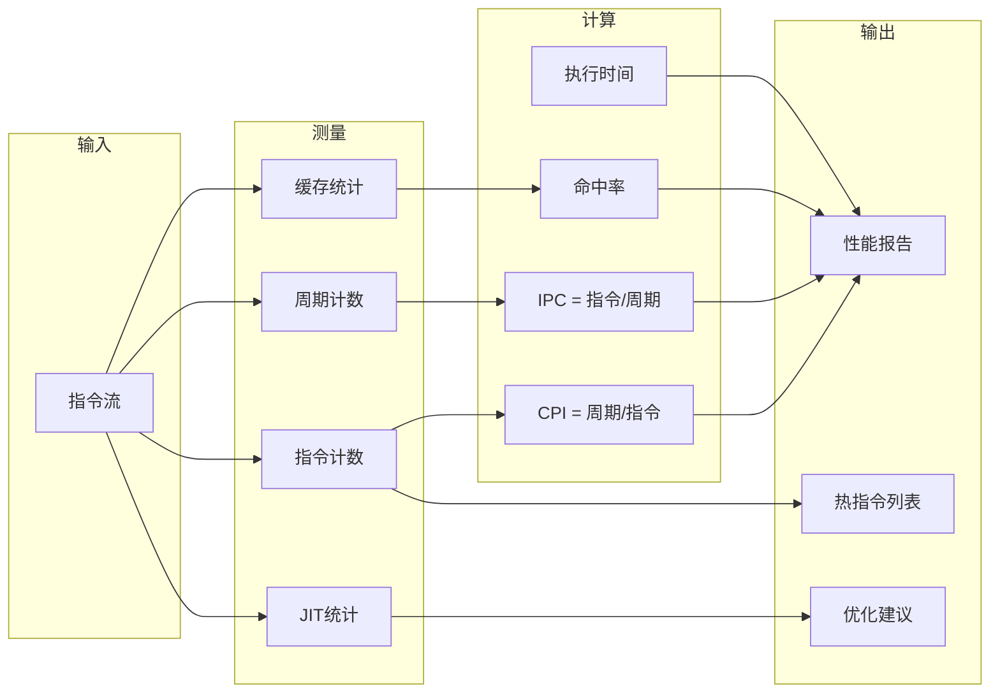

### 指令周期分布

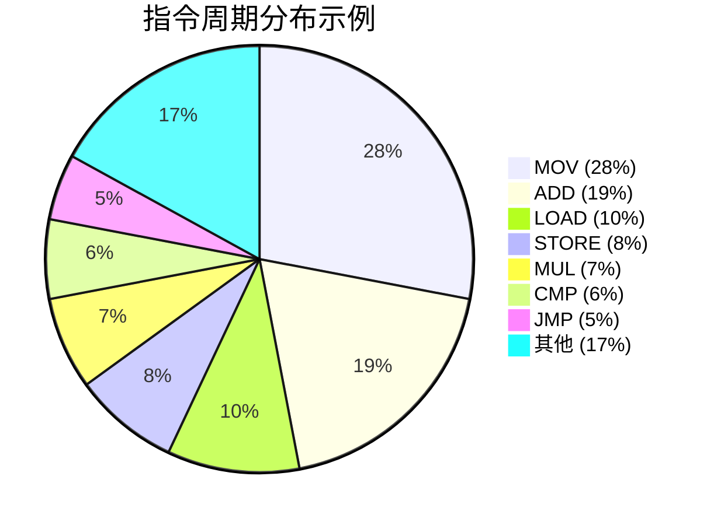

### 性能对比

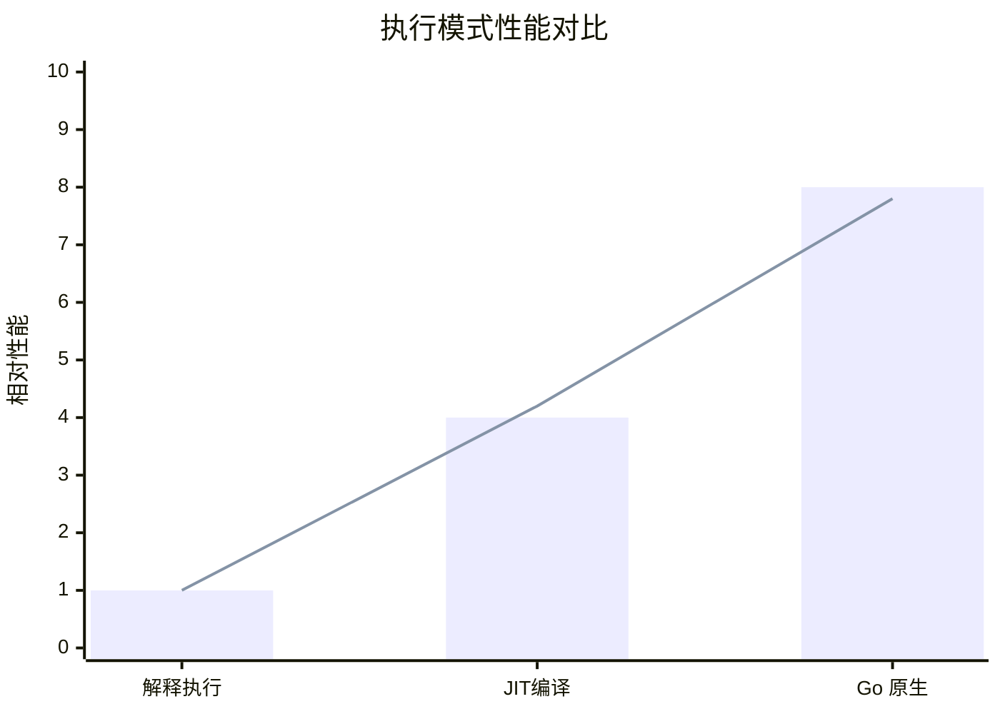

### 统计指标

**执行统计**
- 总指令数
- 总周期数
- CPI (每指令周期数)
- 执行时间
- 指令/秒

**内存统计**
- 内存读取次数
- 内存写入次数

**缓存统计**
- 缓存命中次数
- 缓存缺失次数
- 缓存命中率

**JIT统计**
- JIT调用次数
- JIT缓存命中次数
- JIT命中率
- JIT编译块数

### 指令周期表

| 指令类型 | 延迟(周期) | 说明 |
|----------|------------|------|
| ADD/SUB | 1 | 整数运算 |
| MUL | 3 | 整数乘法 |
| DIV | 10 | 整数除法 |
| LOAD | 4 | 内存加载 |
| STORE | 4 | 内存存储 |
| FADD | 3 | 浮点加法 |
| FMUL | 5 | 浮点乘法 |
| FDIV | 10 | 浮点除法 |
| VADD | 2 | 向量加法 |
| VMUL | 4 | 向量乘法 |

---

## 示例程序

> CIN 语言完整语法见 [CIN 编程指南](docs/CIN_GUIDE.md)。
>
> **CIN 新语法示例**: `examples/control_flow.cin` (break/continue、do-while、switch/case、三目、复合赋值)、
> `examples/literals_types.cin` (char/short/long/unsigned、0x/0b/0o 与字符字面量、`++/--`、转换内建函数);
> 汇编器 `.equ`/表达式示例: `examples/asm_constants.asm`。
>
> **官方标准库 (`codecin/lib/`)**: `math` `str` `array` `sort` `conv` `vec` `rand` `json` `time` `io` `gui` `termux` `test`
> `bits` `stat` `hash` `validate` `matrix` `queue` (共 19 个)
> —— 示例 `examples/modules_demo.cin`、`examples/stdlib_demo.cin` (断言全部通过)。详见
> [CIN 编程指南 · 官方标准库清单](docs/CIN_GUIDE.md#官方标准库清单-lib)。
>
> **CIN 位运算/整除/字符串下标/更多内建**: `& | ^ ~ << >>` (及复合赋值)、`idiv()` 整数除法、
> `s[i]` 单字节读取、`floor/ceil/round/min/max/atoi/trim/ltrim/rtrim` 内建函数 (详见
> [CIN 编程指南 · 运算符/内建](docs/CIN_GUIDE.md))。
>
> **CIN 宿主能力 (GUI / 联网音频 / 系统交互)**: 2D 绘图画布 `canvas/set_color/fill_rect/fill_circle/draw_line/draw_text`
> + `save_png()` 导出 / `show_canvas()` 弹窗查看; 联网音频 `audio_play(url)` / `audio_stop` /
> `audio_volume` / `audio_wait` (http 下载 + WAV 播放); 系统原生交互 `file_read/file_write/file_append/
> file_exists/file_delete/file_size/mkdir/dir_list`、`exec/exec_output`、`getenv/setenv`、
> `os_name/hostname/username/cwd/home_dir` (Windows/Linux/macOS); Termux API `termux_notify/toast/
> clipboard_get/clipboard_set/battery/vibrate/tts/location/wifi_info/dialog/sms_send`。

### 程序执行流程图

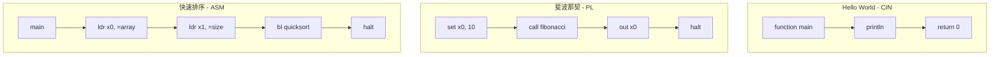

### Hello World (CIN)

```c
function main() {
    println("Hello, World!")
    println("Welcome to Code CIN")
    return 0
}
```

### 斐波那契 (PL)

```asm
.text
main:
    set x0, 10          ; n = 10
    call fib
    sys #22             ; ITOA: x0 -> 十进制字符串
    sys #24             ; PRINT_STR
    output #10
    stop

fib:                    ; 入口 x0 = n, 返回 x0 = fib(n)
    compare x0, 1
    jump_greater recurse
    set x0, 1
    return

recurse:
    push x0
    decrement x0
    call fib
    pop x1
    push x0
    set x0, x1
    decrement x0
    decrement x0
    call fib
    pop x1
    add x0, x1
    return
```

> 注意: 本 ISA **没有 `jle` / `jge`** 这类指令, 比较请用 `CMP` + `JG`/`JL`/`JE`
> (PL 风格: `compare` + `jump_greater`/`jump_less`/`jump_equal`), 或 ARM64 的 `B.<cond>`。
> 上面这段实测输出 `89`; 完整语法与逐条语义见文档站 (仓库内路径 `docs/asm/`)。

### 循环求和 + 字符串打印 (ASM, 见 `test_asm.asm`)

```asm
.text
main:
    MOV x0, #msg
    SYS #24              ; PRINT_STR

    MOV x1, #0           ; sum
    MOV x2, #1           ; i
loop:
    ADD x1, x2
    INC x2
    CMP x2, #11
    B.NE loop

    MOV x0, x1
    SYS #22              ; ITOA -> x0 = 缓冲
    SYS #24              ; PRINT_STR
    OUT #10              ; 换行

    MOV x3, #nums
    SD x1, [x3]          ; 存回数据段
    LD x4, [x3]
    ADDI x4, x4, #100
    MOV x0, x4
    SYS #22
    SYS #24
    OUT #10

    HALT

.data
msg: ASCIZ "Sum 1..10 = "
nums: DQ 0
```

> 实测输出: `Sum 1..10 = 55` 与 `155` (退出码 0)。更多汇编示例 (递归、数组遍历、
> 立即数与表达式、条件后缀) 见文档站 `docs/asm/` 与 `docs/guide/examples.md`。

---

## 技术栈

### 依赖关系图

```mermaid
graph TD
    Code CIN[Code CIN]

    Code CIN --> PY[Python 3.8+]
    Code CIN --> RICH[Rich Library]
    Code CIN --> GO[Go 1.26+ 原生库]
    Code CIN --> STDLIB[Standard Library]

    RICH --> COLOR[彩色输出]
    RICH --> TABLE[表格渲染]
    RICH --> PANEL[面板/Traceback]

    GO --> CSHARE[c-shared 动态库]
    CSHARE --> VM[原生字节码 VM]
    CSHARE --> CROMGO[CROM 加速]

    STDLIB --> STRUCT[struct]
    STDLIB --> ZLIB[zlib]
    STDLIB --> CTYPES[ctypes]
    STDLIB --> RE[正则表达式]
```

| 组件 | 技术 | 说明 |
|------|------|------|
| 语言 | Python 3.8+ | 核心实现语言 (模块化包 `codecin/`) |
| UI/日志 | Rich | 彩色输出、表格、面板、traceback |
| 原生加速 | Go 1.26+ (c-shared) | 原生 VM + CROM, 可选, 自动回退 |
| 压缩 | zlib | CROM压缩 |
| 序列化 | struct | 二进制格式 |
| FFI | ctypes | 加载 Go 共享库 |
| 调试 | 原生Python | 交互式调试 |

> 模块结构、原生库编译与扩展指南见 [开发者编译文档](docs/BUILDING.md)。

---

## 贡献指南

### 贡献流程


### 代码规范

- 遵循PEP 8编码规范
- 使用类型提示
- 编写文档字符串
- 添加单元测试

---

## 联系方式

| 角色 | 信息 |
|------|------|
| 开发组织 | ByUsi Studio |
| 主要开发者 | 北啊呢 |
| 邮箱 | admin@byusistudio.fun |
| GitHub | github.com/ByUsiStudio/codecin |

---

## 致谢

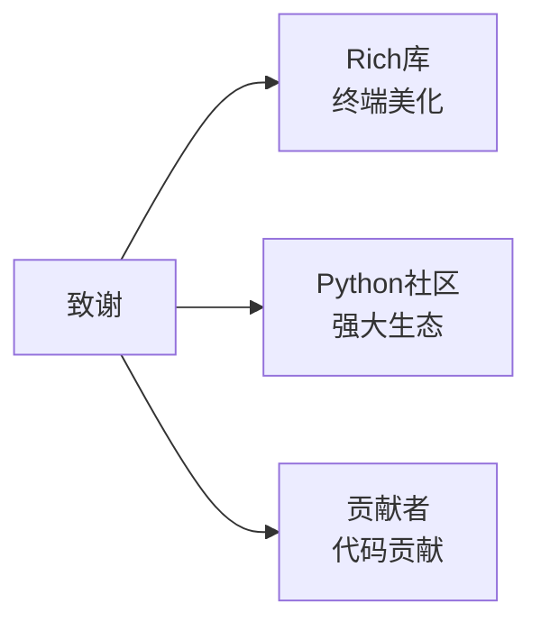

---

**Code CIN - 让编程与运行时变得简单而强大**

---

Made with love by ByUsi Studio