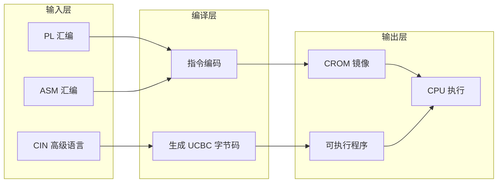
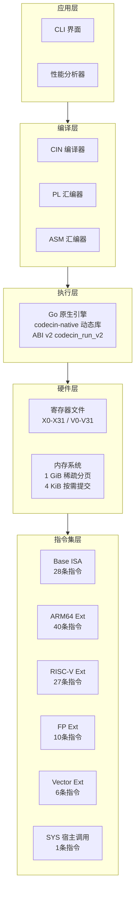
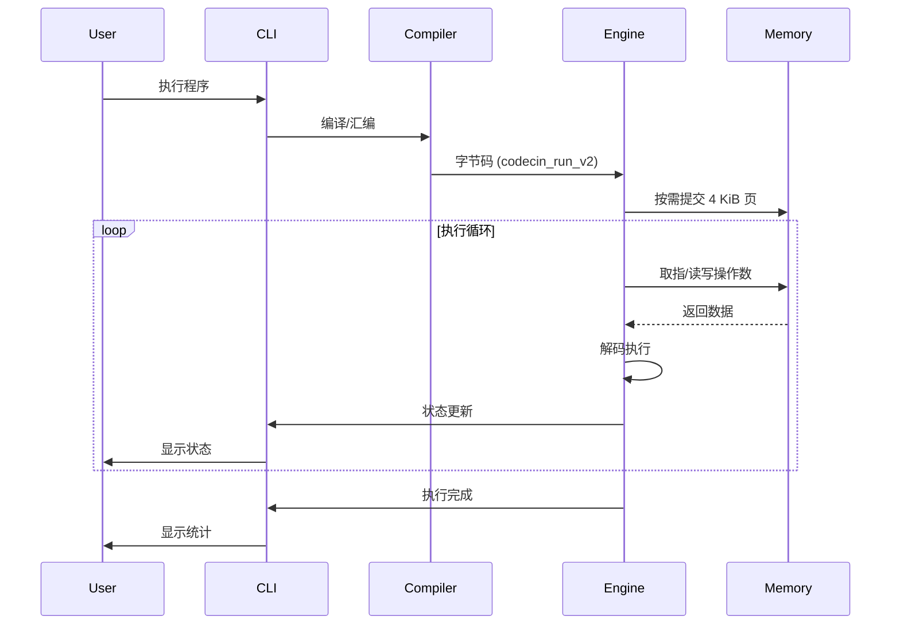
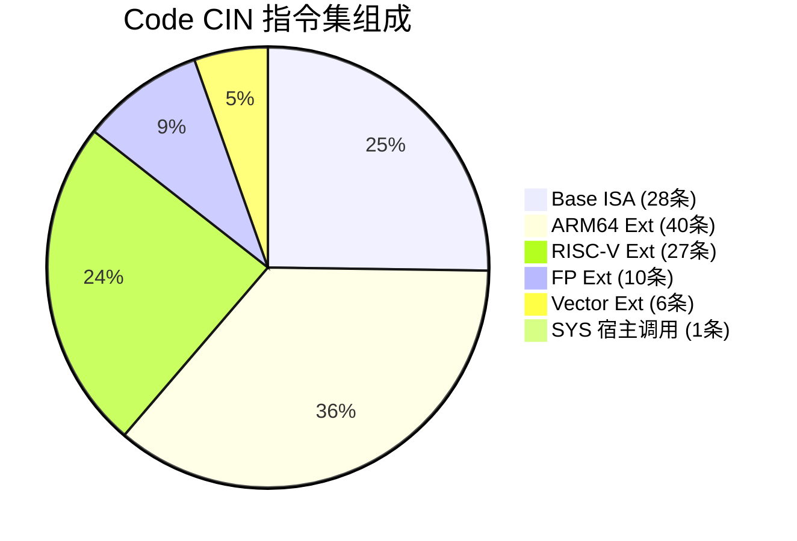
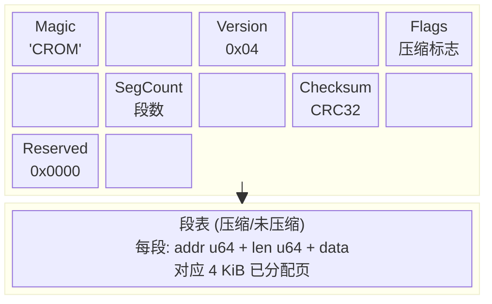
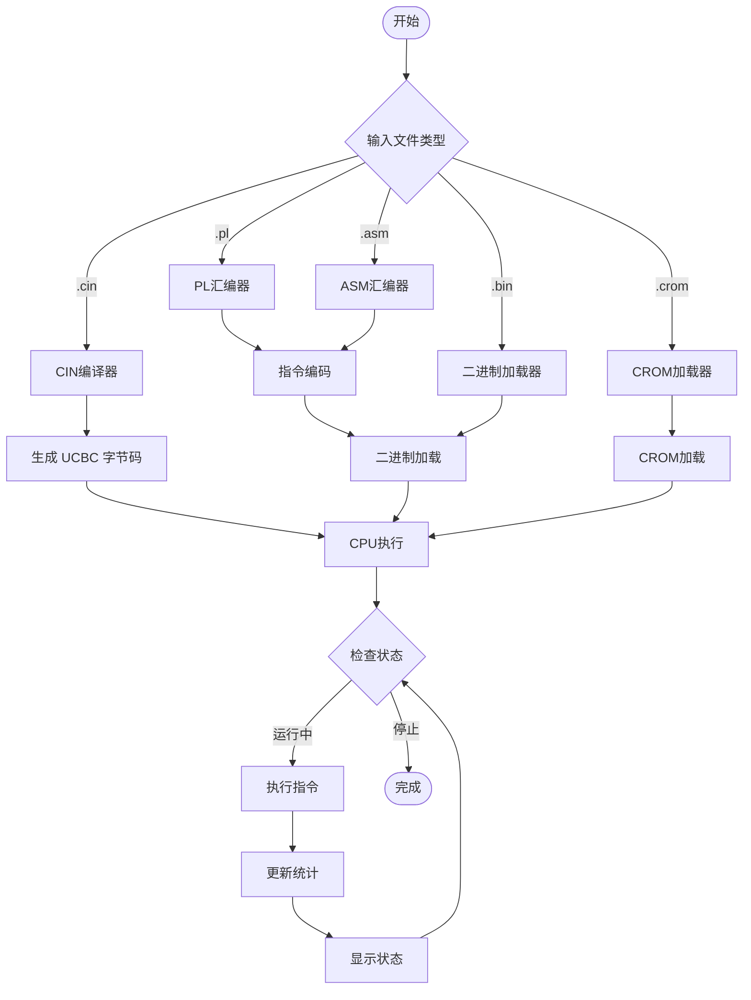
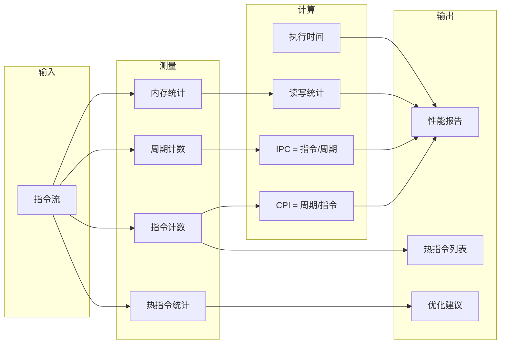
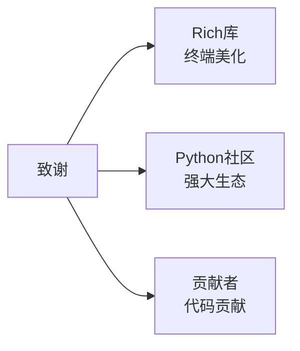

# Code CIN - 高级语言与运行时

---

**Code CIN - ByUsi Studio**

**开发者: 北啊呢**

---

## 项目简介

Code CIN 是一门简洁的类 C 高级语言及其跨平台运行时（VM）。它从 CIN 源码出发，编译为 UCPU 字节码后统一由 **Go 原生引擎**（`codecin-native` 动态库）单路径执行（v5.9.0 起纯 Python 解释器与 JIT 已移除）。除完整语言工具链外，还内置 **2D 绘图画布（导出 PNG）**、**联网音频播放**、**FFI 调用** 与 **完整网络能力（HTTP/TCP/UDP/DNS）** 等宿主能力。

**已完成 Go 优先（v5.9.0）**：Go 是语言实现的核心（`codecin/native/` 下的 CIN 编译器、字节码 VM、CROM），**Go 侧不提供任何 CLI 入口**；Python 只作为唯一 CLI 外壳。支持 CIN/PL/ASM 三语言、ARM64 与 RISC-V 指令集扩展、默认 1 GiB 稀疏分页内存、FFI 与完整网络系统调用、性能分析。

模块化包结构（`codecin/`，Go 侧 `codecin/native/`），全线日志与错误输出基于 **rich**（彩色表格、面板、traceback），`--log-level DEBUG` 提供超详细追踪。

## 文档

**官方文档站**位于独立仓库
[Code-CIN-Docs](https://github.com/ByUsiStudio/Code-CIN-Docs) (VitePress +
vitepress-plugin-tabs); 线上站点即由该仓库构建。本仓库不再内嵌 `docs/`
(子模块已移除), 需要本地预览时请**单独克隆该仓库**:

```bash
git clone https://github.com/ByUsiStudio/Code-CIN-Docs.git
cd Code-CIN-Docs
npm install
npm run docs:dev                           # 本地预览 (http://localhost:5173)
npm run docs:build                         # 构建静态站点到 .vitepress/dist
```

站点内容划分: `guide/` (安装/快速开始/命令行/执行路径/架构/示例/FAQ)、`language/` (CIN 语言)、
`asm/` (汇编与 ISA)、`stdlib/` (内置标准库参考)、`runtime/` (原生/格式/AOT)、
`tools/` (日志/性能)、`reference/` (ISA 编码表/寄存器与内存/Python API/更新日志)、
`dev/` (项目结构/构建/测试/打包/扩展/贡献)。

仓库的开发用文档**全部在独立仓库** [Code-CIN-Docs](https://github.com/ByUsiStudio/Code-CIN-Docs)
(不进站点, 供源码树内直接查阅):

| 文档 | 说明 |
|------|------|
| [指令集参考 (ISA)](https://github.com/ByUsiStudio/Code-CIN-Docs/blob/main/ISA.md) | 由 `codecin/isa.py` 自动生成的逐条指令表 (唯一真源; 站点版为 `reference/isa.md`) |
| [开发者编译文档 (BUILDING)](https://github.com/ByUsiStudio/Code-CIN-Docs/blob/main/BUILDING.md) | 环境搭建、Go 原生库编译、构建产物、打包、日志系统、扩展指南 |
| [CIN 编程指南 (CIN_GUIDE)](https://github.com/ByUsiStudio/Code-CIN-Docs/blob/main/CIN_GUIDE.md) | CIN 高级语言完整语法：类型/函数/struct/数组/字符串/内建函数 |

> 这些文件不在本仓库内: 需要时单独 `git clone` 上述文档仓库即可。

---

## 设计理念

Code CIN的设计围绕五个核心原则展开：


```mermaid
mindmap
  root((Code CIN设计哲学))
    完整性
      完整工具链
      高级语言到机器码
      多语言支持
    性能
      Go 原生引擎
      稀疏分页内存
      快速指令分发
    可用性
      美观终端界面
      沙箱模式
      实时状态显示
    可分析性
      性能分析
      指令统计
      内存统计
    可扩展性
      模块化设计
      丰富指令集
      插件架构
```

---

## 核心特性

### 多语言支持


```mermaid
graph LR
    subgraph 输入层
        A[CIN 高级语言]
        D[PL 汇编]
        G[ASM 汇编]
    end
    
    subgraph 编译层
        B[生成 UCBC 字节码]
        E[指令编码]
    end
    
    subgraph 输出层
        C[可执行程序]
        F[CROM 镜像]
        H[CPU 执行]
    end
    
    A --> B --> C
    D --> E --> F --> H
    G --> E
    C --> H
```

### 功能矩阵

| 功能模块 | 状态 | 说明 |
|----------|------|------|
| 指令集 | 112条 | Base + ARM64 + RISC-V + FP + Vector + SYS |
| 寄存器 | 32+32 | 通用寄存器 + 向量寄存器 |
| 内存系统 | 1 GiB 默认 | 4 KiB 稀疏分页按需提交 + 保护机制 |
| Go原生库 | c-shared (必需) | 整程序 VM 加速, 缺失时报 CPUSimulatorError 提示重建 |
| FFI | SYS 140-144 | ffi_load/ffi_find/ffi_call/ffi_callf/lib_close, 标准 `lib/ffi.cin` |
| 网络 | SYS 145-157 | HTTP/TCP/UDP/DNS, 标准 `lib/net.cin` |
| 日志系统 | rich | 彩色日志/表格/面板/traceback, --log-level DEBUG 超详细追踪 |
| 性能分析 | 指令级 | CPI + 内存统计 + 热指令 |
| CROM压缩 | zlib | 段式格式 (v4), 只保存已分配页 (Go/Python双实现) |
| AOT 静态编译 | 独立可执行 | 编译为 Windows/Linux/macOS 静态可执行文件, 不需 Python/Go/动态库 |

---

## 系统架构

### 分层架构


```mermaid
flowchart TB
    subgraph APP[应用层]
        CLI[CLI 界面]
        PRF[性能分析器]
    end
    
    subgraph COMP[编译层]
        CIN[CIN 编译器]
        PL[PL 汇编器]
        ASM[ASM 汇编器]
    end
    
    subgraph EXEC[执行层]
        NATIVE[Go 原生引擎<br/>codecin-native 动态库<br/>ABI v2 codecin_run_v2]
    end

    subgraph HW[硬件层]
        REG[寄存器文件<br/>X0-X31 / V0-V31]
        MEM[内存系统<br/>1 GiB 稀疏分页<br/>4 KiB 按需提交]
    end
    
    subgraph ISA[指令集层]
        BASE[Base ISA<br/>28条指令]
        ARM64[ARM64 Ext<br/>40条指令]
        RISCV[RISC-V Ext<br/>27条指令]
        FP[FP Ext<br/>10条指令]
        VEC[Vector Ext<br/>6条指令]
        SYS[SYS 宿主调用<br/>1条指令]
    end
    
    APP --> COMP --> EXEC --> HW --> ISA
```

### 数据流


```mermaid
flowchart LR
    SOURCE[源文件<br/>.cin/.pl/.asm] --> COMPILER[编译器/汇编器]
    COMPILER --> BINARY[二进制/CROM]
    BINARY --> CPU[CPU核心]
    CPU --> STATS[统计信息]
    CPU --> DISPLAY[显示输出]
    STATS --> DISPLAY
```

### 执行时序


```mermaid
sequenceDiagram
    participant User
    participant CLI
    participant Compiler
    participant Engine
    participant Memory

    User->>CLI: 执行程序
    CLI->>Compiler: 编译/汇编
    Compiler->>Engine: 字节码 (codecin_run_v2)
    Engine->>Memory: 按需提交 4 KiB 页

    loop 执行循环
        Engine->>Memory: 取指/读写操作数
        Memory-->>Engine: 返回数据
        Engine->>Engine: 解码执行
        Engine->>CLI: 状态更新
        CLI->>User: 显示状态
    end

    Engine->>CLI: 执行完成
    CLI->>User: 显示统计
```

---

## 指令集架构

### 指令集总览


```mermaid
pie title Code CIN 指令集组成
    "Base ISA (28条)" : 28
    "ARM64 Ext (40条)" : 40
    "RISC-V Ext (27条)" : 27
    "FP Ext (10条)" : 10
    "Vector Ext (6条)" : 6
    "SYS 宿主调用 (1条)" : 1
```

> 指令总数与分组由 `python script/gen_isa_docs.py` 依据 `codecin/isa.py` 自动生成/校验;
> 完整的逐条指令表见 [ISA.md](https://github.com/ByUsiStudio/Code-CIN-Docs/blob/main/ISA.md)
> (文档站已在独立仓库)。ARM64 的 WFE/WFI/SEV 无事件模型, 语义等同 NOP。

### 指令分类


```mermaid
graph TD
    ISA[Code CIN ISA<br/>112条指令]
    
    ISA --> BASE[Base ISA<br/>28条指令]
    ISA --> ARM[ARM64 Ext<br/>40条指令]
    ISA --> RISCV[RISC-V Ext<br/>27条指令]
    ISA --> FP[FP Ext<br/>10条指令]
    ISA --> VEC[Vector Ext<br/>6条指令]
    ISA --> SYS[SYS 宿主调用<br/>1条指令]
    
    BASE --> B1[数据传输: MOV, LOAD, STORE]
    BASE --> B2[算术: ADD, SUB, MUL, DIV]
    BASE --> B3[逻辑: AND, OR, XOR, SHL, SHR]
    BASE --> B4[控制: JMP, JZ, CALL, RET]
    
    ARM --> A1[条件: ADDS, SUBS]
    ARM --> A2[移位: LSL, LSR, ASR, ROR]
    ARM --> A3[加载存储: LDR, STR, LDP, STP]
    ARM --> A4[分支: CBZ, CBNZ, B, BL]
    
    RISCV --> R1[加载: LB, LH, LW, LD]
    RISCV --> R2[存储: SB, SH, SW, SD]
    RISCV --> R3[立即数: ADDI, XORI, ORI, ANDI]
    RISCV --> R4[分支: BEQ, BNE, BLT, BGE]
    
    FP --> F1[运算: FADD, FSUB, FMUL, FDIV]
    FP --> F2[比较: FCMP]
    FP --> F3[转换: FCVT]
    
    VEC --> V1[向量运算: VADD, VSUB, VMUL, VDIV]
    VEC --> V2[向量加载存储: VLD1, VST1]
```

### Base指令集 (28条)

| 分类 | 指令 | 说明 |
|------|------|------|
| 数据传输 | MOV, LOAD, STORE | 数据移动和内存访问 |
| 算术 | ADD, SUB, MUL, DIV | 基本算术运算 |
| 逻辑 | AND, OR, XOR, SHL, SHR | 位运算和移位 |
| 控制 | JMP, JZ, JNZ, JE, JL, JG, CALL, RET | 程序流程控制 |
| 堆栈 | PUSH, POP | 栈操作 |
| I/O | IN, OUT | 输入输出 |
| 其他 | CMP, INC, DEC, HALT | 比较、自增、自减、停机 |

### ARM64扩展 (40条)

ADDS, SUBS, ADDC, SUBC, LSL, LSR, ASR, ROR, MVN, EOR, BIC, ORN, LDR, STR, LDP, STP, CBZ, CBNZ, TBZ, TBNZ, B, BL, BR, NOP, WFE, WFI, SEV, CSEL, CSINC, CSINV, CSNEG, SXTB, SXTH, SXTW, UXTB, UXTH, CLZ, CLS, RBIT, REV

> WFE/WFI/SEV: 模拟器无中断/多核事件模型, 语义等同 NOP (见 `codecin/cpu.py` `_OP_ALIASES`)。

### RISC-V扩展 (27条)

LB, LH, LW, LD, SB, SH, SW, SD, ADDI, SLTI, SLTIU, XORI, ORI, ANDI, SLLI, SRLI, SRAI, BEQ, BNE, BLT, BGE, BLTU, BGEU, JALR, JAL, LUI, AUIPC

### 浮点和向量指令

FADD, FSUB, FMUL, FDIV, FCMP, FCVT, FABS, FNEG, LDRS, STRS, VADD, VSUB, VMUL, VDIV, VLD1, VST1

---

## CROM文件格式

### v4段式结构 (v5.9.0)

CROM v4 采用**段式内存镜像**: 只保存已分配的 4 KiB 页, 镜像体积与实际使用的内存成正比
(默认 1 GiB 逻辑空间也只会写出真正写入过的页); 旧版 v3 整块镜像仍可读取 (仅兼容)。
`.bin` 字节码格式同步升级为 **BIN v3** (同样段式, 旧 v2 仅兼容读取)。


```mermaid
block-beta
    columns 5

    block:header:5
        columns 5
        Magic["Magic<br/>'CROM'"] space1[" "]
        Version["Version<br/>0x04"] space2[" "]
        Flags["Flags<br/>压缩标志"] space3[" "]
        SegCount["SegCount<br/>段数"] space4[" "]
        Checksum["Checksum<br/>CRC32"] space5[" "]
        Reserved["Reserved<br/>0x0000"] space6[" "]
    end

    block:segments:5
        columns 5
        Seg["段表 (压缩/未压缩)<br/>每段: addr u64 + len u64 + data<br/>对应 4 KiB 已分配页"]
    end

    header --> segments
```

| 偏移 | 大小 | 字段 | 说明 |
|------|------|------|------|
| 0x00 | 4 | Magic | 'CROM' 魔数 |
| 0x04 | 1 | Version | 0x04 版本号 |
| 0x05 | 1 | Flags | bit0: 压缩标志 |
| 0x06 | 4 | Seg Count | 段数 (已分配页数) |
| 0x0A | 4 | Checksum | CRC32校验和 (对段表整体) |
| 0x0E | 2 | Reserved | 保留字段 |
| 0x10 | N | Segments | 段表: 每段 addr u64 + len u64 + data |

### 版本对比

| 特性 | v3 (旧, 仅读取) | v4 (当前) |
|------|------|------|
| 内存布局 | 整块镜像 | 段式 (只存已分配 4 KiB 页) |
| 压缩支持 | 是 | 是 |
| 校验和 | 是 | 是 |
| 1 GiB 稀疏内存 | 镜像体积随内存上限膨胀 | 镜像体积与实际使用成正比 |

---

## 使用指南

### 执行流程


```mermaid
flowchart TD
    START([开始]) --> INPUT{输入文件类型}
    
    INPUT -->|.cin| CIN[CIN编译器]
    INPUT -->|.pl| PL[PL汇编器]
    INPUT -->|.asm| ASM[ASM汇编器]
    INPUT -->|.bin| BIN[二进制加载器]
    INPUT -->|.crom| CROM[CROM加载器]
    
    CIN --> UCBC[生成 UCBC 字节码]
    UCBC --> EXEC
    
    PL --> ASSEMBLE[指令编码]
    ASM --> ASSEMBLE
    ASSEMBLE --> BINLOAD[二进制加载]
    
    BIN --> BINLOAD
    CROM --> CROMLOAD[CROM加载]
    
    BINLOAD --> EXEC[CPU执行]
    CROMLOAD --> EXEC
    
    EXEC --> CHECK{检查状态}
    CHECK -->|运行中| STEP[执行指令]
    STEP --> STATS[更新统计]
    STATS --> DISPLAY[显示状态]
    DISPLAY --> CHECK
    
    CHECK -->|停止| DONE([完成])
```

### 快速开始

**安装（pip）**

```bash
pip install codecin          # 安装 (内置标准库 codecin/lib/*.cin 随包分发)
pip install -U codecin       # 升级到最新版 (不要锁定版本号)
codecin --version
```

> 安装时会用**本机的 Go 工具链现场编译原生加速库** (`codecin-native` 动态库)。
> 运行时**必须有该动态库**: 缺失时报 `CPUSimulatorError` 并提示重建, **没有解释器回退路径**
> (用 `CODECIN_SKIP_NATIVE=1 pip install codecin` 可显式跳过安装期编译, 但运行前仍需自行构建)。
> 不想本地编译的话, 也可以直接从
> [Release](https://github.com/ByUsiStudio/Code-CIN/releases) 下载对应平台/架构的
> 预编译原生库放进包目录, 详见 [构建文档 · 6.3](docs/BUILDING.md#63-预编译原生库资产-x64-与-arm64)。

**手动（源码树）**

1. 克隆项目:
   ```
   git clone https://github.com/ByUsiStudio/code-cin.git
   cd code-cin
   ```

2. 编译 Go 原生库 (必需, 运行时缺失会报 CPUSimulatorError):
   ```
   cd codecin/native && .\build.ps1        # Linux/Termux/macOS: ./build.sh
   ```

3. 运行:
   ```
   codecin basic.cin                          # 唯一 CLI 入口 (由 Go 原生引擎执行)
   codecin basic.cin                                # 安装后等价的 console script
   codecin --help
   ```

> **Python 只是 CLI 外壳**: 语言实现 (`codecin/native/` 下的 Go 编译器与字节码 VM) 全部在 Go 侧,
> **Go 侧不提供任何 CLI 入口** (`package main`)。

### 开发与测试

```bash
python -m pytest                            # 指令黄金 / 内存保护 / 持久化格式 / CLI 回归
python script/gen_native_isa.py --check     # Go 原生常量与指令集同步
ruff check codecin cpu.py script tests
```

仓库内置 GitHub Actions CI (`.github/workflows/ci.yml`): 多 Python 版本测试、ruff、Go 构建校验,
一个 `integration` 作业会**真实编译原生库**后跑全量测试 (带覆盖率门槛),
以及一个 `dist` 作业断言 wheel/sdist 里确实带有内置标准库。
完整逐条指令表由 `script/gen_isa_docs.py` 从 `codecin/isa.py` 生成到文档仓库
([ISA.md](https://github.com/ByUsiStudio/Code-CIN-Docs/blob/main/ISA.md))。

### 执行路径

v5.9.0 起**只有一条执行路径**: Python 完成 CIN/PL/ASM 编译后, 通过 cgo ABI v2
(`codecin_run_v2`) 把整程序交给 `codecin-native` 动态库一次执行完毕。
动态库缺失时报 `CPUSimulatorError` 并提示重建原生库, **没有解释器/JIT 回退路径**
(纯 Python 解释器与 JIT 已在 v5.9.0 移除)。

### 编译成独立可执行文件 (AOT)

把 CIN 程序编译成**静态链接的独立可执行文件** —— 产物内嵌字节码与初始内存镜像,
由内置 Go VM 执行, 运行时**不需要 Python、Go 工具链、libc 或任何动态库**。
构建时会解析 `import` 闭包做依赖完整性检查, 并把**全部依赖库在编译期展开嵌入产物**
(产物不读取任何 `.cin` 文件):

```bash
# 本机平台
codecin program.cin --build-exe program          # Windows 自动补 .exe

# 交叉编译 (只需要安装 Go 工具链)
codecin program.cin --build-exe app-linux --build-target linux/amd64
codecin program.cin --build-exe app-mac   --build-target darwin/arm64
```

| 目标 | 说明 |
|------|------|
| `windows/amd64` `windows/arm64` | PE, 静态 (CGO_ENABLED=0) |
| `linux/amd64` `linux/arm64` | ELF, **无 PT_INTERP**, 不依赖 glibc |
| `darwin/amd64` `darwin/arm64` | Mach-O, 静态 |

常见选项: `--build-target OS/ARCH`、`--build-keep-temp` (保留 `go build` 临时目录排错)。
`import "math.cin"`（裸名字 = codecin 内置标准库 `codecin/lib/`）在**编译期**展开, 因此产物自带用到的标准库, 运行时不需要任何 `.cin` 文件。
正常结束退出码 0, 运行期错误打印 stderr 并以 1 退出。
详见 [开发者编译文档 · AOT](docs/BUILDING.md#aot-编译独立可执行文件)。

### 命令行选项

**基础执行**
- `codecin program.cin` - 运行CIN程序
- `codecin program.pl` - 运行PL程序
- `codecin program.asm` - 运行ASM程序
- `codecin program.bin` - 运行字节码

**信息查询**
- `--version/-V` - 显示版本号并退出
- `--build-info` - 显示构建/运行环境信息 (版本、解释器、平台、原生库; 与 `--json` 合用输出机器可读 JSON)
- `--libs` - 列出内置标准库并标注执行路径要求

**日志与运行时行为**
- `--log-level DEBUG|INFO|WARNING|ERROR|CRITICAL` - 日志级别 (默认 INFO)
- `--log-file <file>` - 日志输出到文件
- `--sandbox` - 沙箱模式 (在 Go 引擎侧拦截全部宿主能力系统调用)
- `--mem-size <bytes>` - 内存大小 (默认 1 GiB, 稀疏分页, 只占实际写入的物理内存)
- `--max-instructions <n>` - 指令数上限
- `--seed <n>` - 随机种子 (确定性执行)
- `--bounds-check` - CIN 数组越界运行时检查 (编译期注入)

**编译选项**
- `--compile` / `--compile-only` - 编译为 .bin 字节码
- `--optimize 0-3` - 优化级别 (默认 0)
- `--disasm` - 反汇编 .bin 字节码为文本清单后退出
- `-o, --output <file>` - 输出文件名 (.crom/.bin)
- `--strict` - 严格汇编模式

**CROM选项**
- `--save` - 执行后保存 .crom 内存镜像 (v4 段式)
- `--no-compress` - 禁用压缩
- `--crom <file>` - 加载指定 CROM 镜像

---

## 日志与调试 (rich)

全线日志与错误输出基于 **rich**: 彩色表格、面板、进度与完整 traceback。模块不直接 `print`, 统一经 `codecin/console.py` 适配层输出。

### 日志级别

| 级别 | 内容 |
|------|------|
| `ERROR` | 仅错误面板 |
| `WARNING` | + 警告与兼容降级提示 |
| `INFO` (默认) | + 编译汇总、执行起止、统计表 |
| `DEBUG` | **超详细**: 全部埋点 + 逐指令追踪 |

### 超详细输出 (`--log-level DEBUG`)

- **CPU 初始化 dump**: 内存大小、SP 初值、堆基址
- **逐指令追踪**: 每条指令输出 PC、全局序号、操作数值、SP 与执行后 NZCV 标志
  ```
  PC=0x0004 #00000002 ADD X1=0x0(0) X2=0x1(1)  SP=0xfff8
    => pc=0x0005 N=0 Z=0 C=0 V=0
  ```
- **内存读写追踪**: `MEM WR @0x000c w=1 value=0x0`, 覆盖全部加载/存储指令
- **SYS 系统调用** (功能号+参数, 含 FFI/网络调用)
- **编译埋点**: CIN tokenize/parse 统计、原生库调用参数

### 错误处理

- 加载/汇编/编译/运行错误统一红色 rich 面板, 带 `文件:行号` 定位
- 未预期异常输出 rich 彩色完整 traceback

```
┌──────────────────────── Load Error ────────────────────────┐
│ prog.cin:12: Compiler error: Unknown function: printline   │
└────────────────────────────────────────────────────────────┘
```

详见 [开发者编译文档 · 日志系统](docs/BUILDING.md#7-日志系统-rich-与-debug-超详细输出)。

---

## 性能分析

### 性能指标流


```mermaid
flowchart LR
    subgraph INPUT[输入]
        I1[指令流]
    end
    
    subgraph MEASURE[测量]
        M1[指令计数]
        M2[周期计数]
        M3[内存统计]
        M4[热指令统计]
    end

    subgraph CALC[计算]
        C1[CPI = 周期/指令]
        C2[IPC = 指令/周期]
        C3[读写统计]
        C4[执行时间]
    end
    
    subgraph OUTPUT[输出]
        O1[性能报告]
        O2[热指令列表]
        O3[优化建议]
    end
    
    I1 --> M1 --> C1
    I1 --> M2 --> C2
    I1 --> M3 --> C3
    I1 --> M4
    
    C1 --> O1
    C2 --> O1
    C3 --> O1
    C4 --> O1
    M1 --> O2
    M4 --> O3
```

### 指令周期分布


```mermaid
pie title 指令周期分布示例
    "MOV (28%)" : 28
    "ADD (19%)" : 19
    "LOAD (10%)" : 10
    "STORE (8%)" : 8
    "MUL (7%)" : 7
    "CMP (6%)" : 6
    "JMP (5%)" : 5
    "其他 (17%)" : 17
```

### 统计指标

**执行统计**
- 总指令数
- 总周期数
- CPI (每指令周期数)
- 执行时间
- 指令/秒

**内存统计**
- 内存读取次数
- 内存写入次数

### 指令周期表

| 指令类型 | 延迟(周期) | 说明 |
|----------|------------|------|
| ADD/SUB | 1 | 整数运算 |
| MUL | 3 | 整数乘法 |
| DIV | 10 | 整数除法 |
| LOAD | 4 | 内存加载 |
| STORE | 4 | 内存存储 |
| FADD | 3 | 浮点加法 |
| FMUL | 5 | 浮点乘法 |
| FDIV | 10 | 浮点除法 |
| VADD | 2 | 向量加法 |
| VMUL | 4 | 向量乘法 |

---

## FFI 与网络 (v5.9.0)

### 稀疏分页内存

运行时内存默认 **1 GiB** 逻辑空间, 按 **4 KiB 页稀疏分页、按需提交**: 只有真正写入过的
页才占用物理内存, 大数组开箱即用, 一般不再需要 `--mem-size` (仅在需要调整上限时使用)。
持久化格式 (CROM v4 / BIN v3) 同样只保存已分配的 4 KiB 页。

### FFI 调用 (SYS 140-144)

新增系统调用 `ffi_load` / `ffi_find` / `ffi_call` / `ffi_callf` / `lib_close`:
加载宿主平台动态库 (Windows `LoadLibrary` / Unix `dlopen`), 按名字查找符号并调用。
标准库 [lib/ffi.cin](codecin/lib/ffi.cin) 在此之上封装出 `ffi_call0..8` / `ffi_callf1..4`
等便捷函数。

### 网络系统调用 (SYS 145-157)

新增完整网络能力: `http_req` / `http_code` (既有 `http_get` / `http_post`)、
TCP `tcp_dial` / `tcp_send` / `tcp_recv` / `tcp_close` / `tcp_listen` / `tcp_accept`、
UDP `udp_open` / `udp_sendto` / `udp_recvfrom` / `udp_close`、`dns_lookup`。
标准库 [lib/net.cin](codecin/lib/net.cin) 提供 `tcp_send_str` / `tcp_recv_line` /
`udp_send_str` / `http_ok` / `dns_resolve` 等高层封装。

---

## 示例程序

> CIN 语言完整语法见 [CIN 编程指南](docs/CIN_GUIDE.md)。
>
> **CIN 新语法示例**: `examples/control_flow.cin` (break/continue、do-while、switch/case、三目、复合赋值)、
> `examples/literals_types.cin` (char/short/long/unsigned、0x/0b/0o 与字符字面量、`++/--`、转换内建函数);
> 汇编器 `.equ`/表达式示例: `examples/asm_constants.asm`。
>
> **官方标准库 (`codecin/lib/`)**: `math` `str` `array` `sort` `conv` `vec` `rand` `json` `time` `io` `gui` `key` `termux` `test`
> `bits` `stat` `hash` `validate` `matrix` `queue` `set` `heap` `tree` `graph` `unionfind` `bigint` `bitset` `dp` `combin` `frac`
> `csv` `fmt` `text` `token` `codec` `path` `cstd` `cppstd` `gostd` `ffi` `net` (共 41 个)
> —— 示例 `examples/modules_demo.cin`、`examples/stdlib_demo.cin` (断言全部通过)。详见
> [CIN 编程指南 · 官方标准库清单](docs/CIN_GUIDE.md#官方标准库清单-lib)。
>
> **CIN 位运算/整除/字符串下标/更多内建**: `& | ^ ~ << >>` (及复合赋值)、`idiv()` 整数除法、
> `s[i]` 单字节读取、`floor/ceil/round/min/max/atoi/trim/ltrim/rtrim` 内建函数 (详见
> [CIN 编程指南 · 运算符/内建](docs/CIN_GUIDE.md))。
>
> **CIN 宿主能力 (GUI / 联网音频 / 系统交互)**: 2D 绘图画布 `canvas/set_color/fill_rect/fill_circle/draw_line/draw_text`
> + `save_png()` 导出 / `show_canvas()` 弹窗查看; 联网音频 `audio_play(url)` / `audio_stop` /
> `audio_volume` / `audio_wait` (http 下载 + WAV 播放); 系统原生交互 `file_read/file_write/file_append/
> file_exists/file_delete/file_size/mkdir/dir_list`、`exec/exec_output`、`getenv/setenv`、
> `os_name/hostname/username/cwd/home_dir` (Windows/Linux/macOS); Termux API `termux_notify/toast/
> clipboard_get/clipboard_set/battery/vibrate/tts/location/wifi_info/dialog/sms_send`。
>
> **FFI 与网络 (v5.9.0)**: 标准库 `lib/ffi.cin` (调用宿主动态库) 与 `lib/net.cin`
> (HTTP/TCP/UDP/DNS), 详见下文「FFI 与网络」章节。

### 程序执行流程图


```mermaid
flowchart TD
    subgraph CIN[Hello World - CIN]
        C1[function main] --> C2[println]
        C2 --> C3[return 0]
    end
    
    subgraph PL[斐波那契 - PL]
        P1[set x0, 10] --> P2[call fibonacci]
        P2 --> P3[out x0]
        P3 --> P4[halt]
    end
    
    subgraph ASM[快速排序 - ASM]
        A1[main] --> A2[ldr x0, =array]
        A2 --> A3[ldr x1, =size]
        A3 --> A4[bl quicksort]
        A4 --> A5[halt]
    end
```

### Hello World (CIN)

```c
function main() {
    println("Hello, World!")
    println("Welcome to Code CIN")
    return 0
}
```

### 斐波那契 (PL)

```asm
.text
main:
    set x0, 10          ; n = 10
    call fib
    sys #22             ; ITOA: x0 -> 十进制字符串
    sys #24             ; PRINT_STR
    output #10
    stop

fib:                    ; 入口 x0 = n, 返回 x0 = fib(n)
    compare x0, 1
    jump_greater recurse
    set x0, 1
    return

recurse:
    push x0
    decrement x0
    call fib
    pop x1
    push x0
    set x0, x1
    decrement x0
    decrement x0
    call fib
    pop x1
    add x0, x1
    return
```

> 注意: 本 ISA **没有 `jle` / `jge`** 这类指令, 比较请用 `CMP` + `JG`/`JL`/`JE`
> (PL 风格: `compare` + `jump_greater`/`jump_less`/`jump_equal`), 或 ARM64 的 `B.<cond>`。
> 上面这段实测输出 `89`; 完整语法与逐条语义见文档站 (仓库内路径 `docs/asm/`)。

### 循环求和 + 字符串打印 (ASM, 见 `test_asm.asm`)

```asm
.text
main:
    MOV x0, #msg
    SYS #24              ; PRINT_STR

    MOV x1, #0           ; sum
    MOV x2, #1           ; i
loop:
    ADD x1, x2
    INC x2
    CMP x2, #11
    B.NE loop

    MOV x0, x1
    SYS #22              ; ITOA -> x0 = 缓冲
    SYS #24              ; PRINT_STR
    OUT #10              ; 换行

    MOV x3, #nums
    SD x1, [x3]          ; 存回数据段
    LD x4, [x3]
    ADDI x4, x4, #100
    MOV x0, x4
    SYS #22
    SYS #24
    OUT #10

    HALT

.data
msg: ASCIZ "Sum 1..10 = "
nums: DQ 0
```

> 实测输出: `Sum 1..10 = 55` 与 `155` (退出码 0)。更多汇编示例 (递归、数组遍历、
> 立即数与表达式、条件后缀) 见文档站 `docs/asm/` 与 `docs/guide/examples.md`。

---

## 技术栈

### 依赖关系图

```mermaid
graph TD
    Code CIN[Code CIN]

    Code CIN --> PY[Python 3.8+]
    Code CIN --> RICH[Rich Library]
    Code CIN --> GO[Go 1.26+ 原生库]
    Code CIN --> STDLIB[Standard Library]

    RICH --> COLOR[彩色输出]
    RICH --> TABLE[表格渲染]
    RICH --> PANEL[面板/Traceback]

    GO --> CSHARE[c-shared 动态库]
    CSHARE --> VM[原生字节码 VM]
    CSHARE --> CROMGO[CROM 加速]

    STDLIB --> STRUCT[struct]
    STDLIB --> ZLIB[zlib]
    STDLIB --> CTYPES[ctypes]
    STDLIB --> RE[正则表达式]
```

| 组件 | 技术 | 说明 |
|------|------|------|
| 语言 | Python 3.8+ | 核心实现语言 (模块化包 `codecin/`) |
| UI/日志 | Rich | 彩色输出、表格、面板、traceback |
| 原生引擎 | Go 1.26+ (c-shared) | 原生 VM + CROM, 必需 (缺失时报 CPUSimulatorError, 无回退) |
| 压缩 | zlib | CROM压缩 |
| 序列化 | struct | 二进制格式 |
| FFI | ctypes | 加载 Go 共享库 |

> 模块结构、原生库编译与扩展指南见 [开发者编译文档](docs/BUILDING.md)。

---

## 贡献指南

### 贡献流程


```mermaid
flowchart LR
    subgraph DEV[开发流程]
        FORK[Fork项目]
        BRANCH[创建特性分支]
        CODE[编写代码]
        TEST[运行测试]
        COMMIT[提交更改]
        PUSH[推送到分支]
        PR[Pull Request]
    end
    
    subgraph REVIEW[审查流程]
        CHECK[代码检查]
        REVIEW2[同行审查]
        MERGE[合并到主分支]
    end
    
    FORK --> BRANCH --> CODE --> TEST
    TEST --> COMMIT --> PUSH --> PR
    PR --> CHECK --> REVIEW2 --> MERGE
```

### 代码规范

- 遵循PEP 8编码规范
- 使用类型提示
- 编写文档字符串
- 添加单元测试

---

## 联系方式

| 角色 | 信息 |
|------|------|
| 开发组织 | ByUsi Studio |
| 主要开发者 | 北啊呢 |
| 邮箱 | admin@byusistudio.fun |
| GitHub | github.com/ByUsiStudio/codecin |

---

## 致谢


```mermaid
flowchart LR
    THANKS[致谢]
    
    THANKS --> RICH[Rich库<br/>终端美化]
    THANKS --> PY[Python社区<br/>强大生态]
    THANKS --> CONTRIB[贡献者<br/>代码贡献]
```

---

**Code CIN - 让编程与运行时变得简单而强大**

---

Made with love by ByUsi Studio